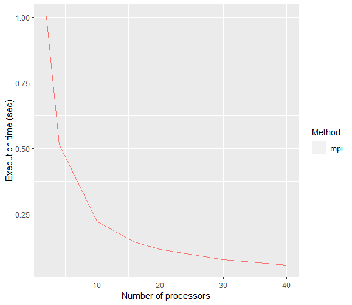
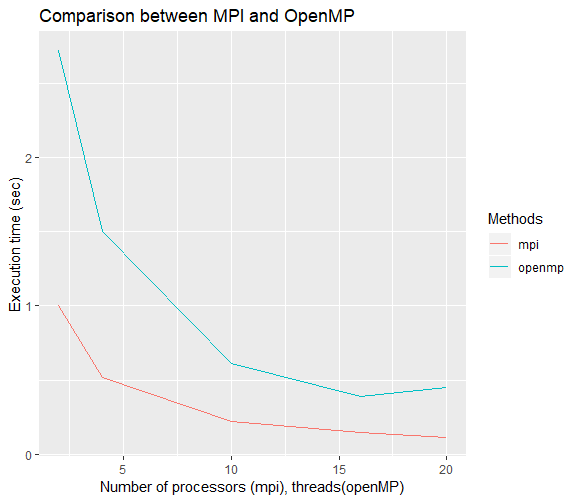

The aim of this assignment is to compute the approximation of PI using a parallel approach based on MPI. Pi is computed by approximating an integral using the midpoint method (with 10^9 rettangules).

To test the scalability of the program, we ran it with a number of processes
ranging from 1 to 40 and using `10^9` breaks in the `[0,1]` interval.
The resulting times to solution are the following:

We can see that the the code scales properly as the number of processes is
increased.

### MPI vs OpenMP
We also compared the above implementation with the previous version of the
program obtained using OpenMP. Again the two programs have been tested one against
the other using a number of processes/threads ranging from 1 to 20.

